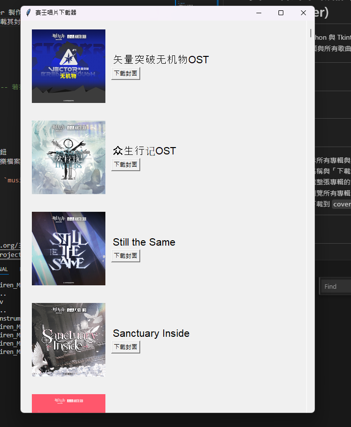

# 賽壬唱片下載器 (Monster Siren Album Cover Downloader)

本專案是一個使用 Python 與 Tkinter 製作的 GUI 應用程式，可瀏覽《賽壬唱片》（Monster Siren）的所有專輯，並下載其封面與所有歌曲。資料來自官方 API，圖像介面簡潔直觀。

---

## 🖼️ 介面截圖



---

## 📦 功能介紹

- 以列表方式顯示所有專輯與封面
- 每張專輯顯示名稱與「下載封面」按鈕
- 點擊按鈕可下載整張專輯的封面與音樂檔案
- 支援滾動捲軸瀏覽所有專輯
- 圖片、歌曲會下載到 `covers/` 與 `music_downloads/` 資料夾中

---

## 🛠️ 使用技術

- Python 3
- [Tkinter](https://docs.python.org/3/library/tkinter.html) - GUI 建構
- [Requests](https://pypi.org/project/requests/) - 發送 API 請求
- [Pillow](https://pypi.org/project/Pillow/) - 圖片處理

---

## 📁 專案結構
project/

│

├── covers/ # 專輯封面圖片儲存位置

├── music_downloads/ # 下載歌曲儲存位置

├── SirenMusicCatcher.py # 主程式

├── README.md # 本文件

└── requirements.txt # 依賴套件清單（建議新增）


---

## ▶️ 執行方式

### 1️⃣ 安裝依賴

請先安裝必要的套件（建議使用虛擬環境）：

```bash
pip install -r requirements.txt
```

### 📌 注意事項
 - 請確保有穩定的網路連線以便下載圖片與音樂。
 - 有些專輯的資料較大，下載時間可能稍久。
 - 若出現 HTTP 錯誤，請稍後再試，或檢查 API 是否變動。

### 📜 版權聲明
此工具僅作為學術與個人用途展示，所有音樂、圖像資源皆屬於《賽壬唱片》（Monster Siren）與其版權擁有者。請勿用於商業用途或散佈資源。

### 🙋‍♂️ 作者
Clark - Python Developer
如果你喜歡這個工具，歡迎點 ⭐ 或給予回饋！