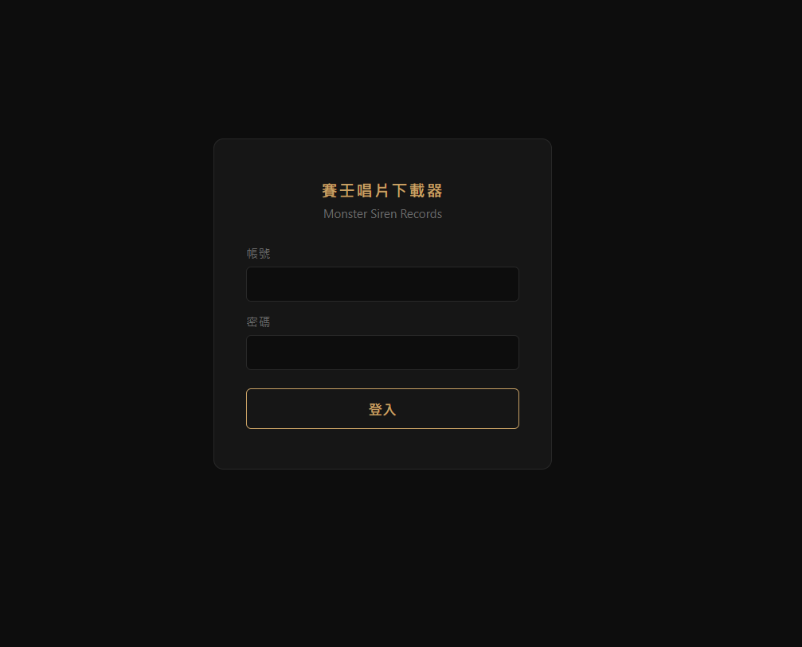
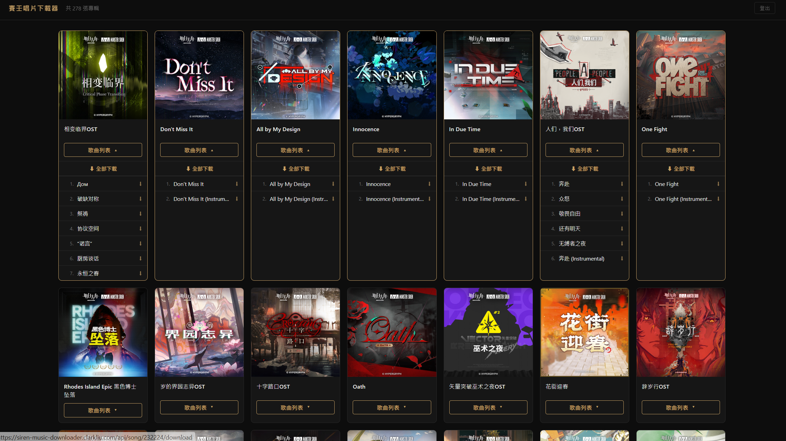

# 賽壬唱片下載器 (Monster Siren Music Downloader)

一個以 Flask 製作的 Web 介面工具，可瀏覽並下載《賽壬唱片》（Monster Siren Records）全部專輯的封面與音樂檔案，資料來自官方 API。

---

## 介面截圖

### 登入頁面



### 專輯瀏覽頁面



---

## 功能介紹

- 帳號密碼登入保護，防止未授權存取
- 以卡片方式列出所有專輯與封面圖
- 每張專輯可展開歌曲清單，逐首下載
- 「全部下載」按鈕一鍵下載整張專輯所有歌曲
- 封面圖片本地快取，減少重複請求
- 支援 Railway 雲端部署

---

## 快速開始

### 1. 安裝依賴

```bash
pip install -r requirements.txt
```

### 2. 設定環境變數

在專案根目錄建立 `.env` 檔案：

```env
SECRET_KEY=你的隨機密鑰字串
SIREN_USERNAME=自訂帳號
SIREN_PASSWORD=自訂密碼
```

| 變數名稱 | 說明 |
|---|---|
| `SECRET_KEY` | Flask Session 加密金鑰，建議使用隨機長字串 |
| `SIREN_USERNAME` | 登入帳號（自行設定） |
| `SIREN_PASSWORD` | 登入密碼（自行設定） |

### 3. 啟動伺服器

```bash
python app.py
```

瀏覽器開啟 `http://localhost:5000`，輸入帳號密碼後即可使用。

---

## 使用方式

1. 開啟網頁，進入**登入頁面**，輸入在 `.env` 設定的帳號與密碼，點擊「登入」。
2. 登入後進入**專輯列表**，畫面顯示所有專輯封面與名稱。
3. 點擊「**全部下載**」可下載該專輯所有歌曲。
4. 展開專輯卡片可看見個別歌曲，點擊歌曲旁的下載按鈕可單曲下載。
5. 點擊右上角「登出」即可結束工作階段。

---

## 部署到 Railway

本專案已包含 `Procfile`，可直接部署至 [Railway](https://railway.app/)。

1. 將專案推送至 GitHub。
2. 在 Railway 建立新專案並連結 GitHub 儲存庫。
3. 在 Railway 的 **Variables** 頁面設定以下環境變數：
   - `SECRET_KEY`
   - `SIREN_USERNAME`
   - `SIREN_PASSWORD`
4. 部署完成後即可透過 Railway 提供的網址存取。

---

## 專案結構

```
project/
├── app.py                  # Flask 主程式
├── SirenMusicCatcher.py    # 原始 Tkinter GUI 版本
├── templates/              # HTML 模板
├── covers/                 # 專輯封面快取
├── music_downloads/        # 下載歌曲儲存位置
├── requirements.txt        # 依賴套件
├── Procfile                # Railway 部署設定
└── .env                    # 本地環境變數（不應提交至 Git）
```

---

## 使用技術

| 技術 | 用途 |
|---|---|
| Python 3 | 主要語言 |
| Flask | Web 框架 |
| Requests | 呼叫 Monster Siren API |
| python-dotenv | 載入 `.env` 環境變數 |
| Gunicorn | 正式環境 WSGI 伺服器 |

---

## 注意事項

- 請確保有穩定的網路連線。
- 部分專輯資料較大，下載時間可能稍久。
- 若出現 HTTP 錯誤，請稍後再試，或確認 API 是否有所變動。
- `.env` 檔案含有敏感資訊，請勿提交至版本控制。

---

## 版權聲明

此工具僅供學術與個人用途，所有音樂、圖像資源皆屬於《賽壬唱片》（Monster Siren Records）與其版權擁有者。請勿用於商業用途或散佈資源。

---

## 作者

Clark — Python Developer  
如果你喜歡這個工具，歡迎點 ⭐ 或給予回饋！
